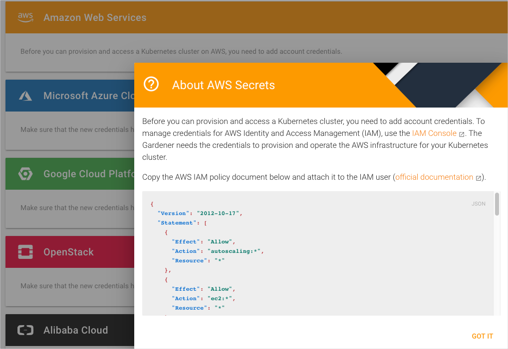
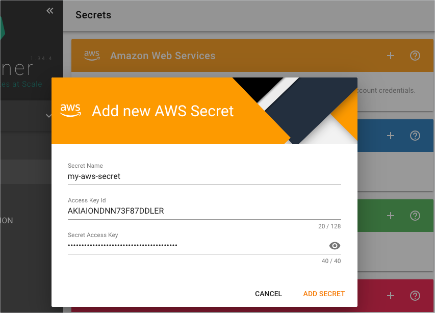

# Provision an AWS cluster with Gardener

## Overview

This example shows you how you can use Hydroform to provision a cluster on Amazon Web Services platform using Gardener. For the example to work, you need to configure Gardener and AWS to allow access. 


## Installation

### Configure Gardener and AWS


1. Create a project in Gardener.

    

2. Go to **Secrets** > **Amazon Web Services**. Click **?** and copy the AWS IAM policy. AWS needs it to grant access for Gardener.

    

3. Go to the AWS IAM Console. Use the instructions to create [a new policy](https://gardener.cloud/050-tutorials/content/howto/gardener_aws/#create-new-policy) and [Gardener technical user](https://gardener.cloud/050-tutorials/content/howto/gardener_aws/#create-a-new-technical-user). Make sure you store the **Access Key Id** and **Secret Access Key** for this user.

4. In Gardener, go to **Secrets** > **Amazon Web Services** to add a new secret. Use the **Access Key Id** and **Secret Access Key** provided in the previous step.

    

6. Go to **Members** > **Service Accounts** to add a new service account. 

    

7. Download and save the `kubeconfig` file for this service account. 

    

### Run the example

1. To provision a new cluster on AWS, go to the `hydroform` directory and run:

```
go run ./examples/gardener/main.go -p {project_name} -c {/path/to/gardener/kubeconfig} -s {AWS-secret-name}
```
2. In Gardener, go to **Clusters** to see your cluster on the list.