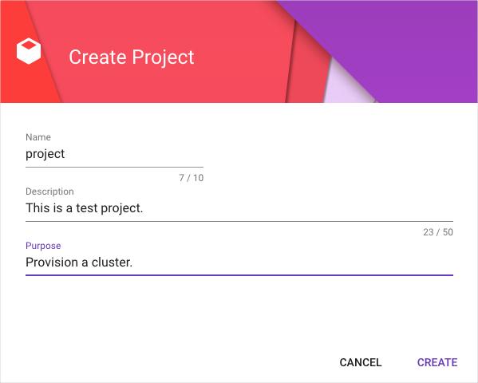

# Provision an Azure cluster with Gardener

## Overview

This example shows you how you can use Gardener to provision a cluster on Microsoft Azure Cloud (Azure). For the example to work, you need to configure Gardener and Azure to enable mutual access. 


## Installation

### Configure Gardener and GCP


1. In Gardener, click **+Create project** to set up a new project on Gardener. 

    

2. Go to **Secrets** > **Microsoft Azure Cloud**. Click **?** and to learn more about Azure Secrets. You will need this information for Azure to grant the access to Gardener.

3. Request an Azure service account, you don't have it already.

4. Once you have the account, log in to Azure to get the properties of your Azure account:

* For **Tenant ID** , go to **Azure Active Directory** > **Properties** and copy the **Directory ID**.
* For **Subscription ID**, go **Subscriptions**  and copy the Subscription ID.
* For **Client ID**, go to **Subscriptions** > **Access control (IAM)** >**Role Assigments**. Find your Service Principal and click it. Go to **Properties** and copy the **Application ID**.
* For **Client Secret**, copy **Key Value** you received in the email with Service Principle credentials.

4. In Gardener, go to **Secrets** > **Azure** and click **+** to add a new secret. Paste the Service Account Key and add the Secret. 

    


6. Go to **Members** > **Service Accounts**. Click **+** to add a new service account. 

    

7. Download the `kubeconfig` file for this service account. 

    

### Run the example

1. To provision a new cluster on Azure, go to the `hydroform` directory and run:

```
go run ./examples/gardener/main.go -p {project_name} -c {/path/to/gardener/kubeconfig} -s {Azure-secret-name}

```

2. In Gardener, go to **Clusters**. You should see your cluster listed there.