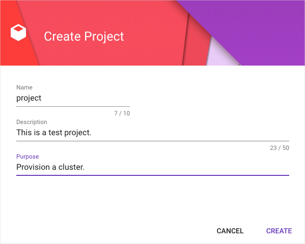

# Provision a GCP cluster with Gardener

## Overview

This example shows you how you can use Gardener to provision a cluster on Google Cloud Platform (GCP). For the example to work, you need to configure Gardener and GCP to enable mutual access. 


## Installation

### Configure Gardener and GCP


1. In Gardener, click **+Create project** to set up a new project on Gardener. 

    

2. Go to **Secrets** > **Google Cloud Platform**. Click **?** and to learn more about GCP Service Accounts. You will need this information for GCP to grant the access to Gardener.

3. Run `gcloud auth application-default login` and log in with your Google Cloud credentials to get authenticated by Google SDK.

3. Use the instructions to create [a new service account and assign roles](https://gardener.cloud/050-tutorials/content/howto/gardener_gcp/#create-a-new-serviceaccount-and-assign-roles). Make sure you download the Service Account Key in JSON format.

4. In Gardener, go to **Secrets** > **Google Cloud Platform** and click **+** to add a new secret. Paste the Service Account Key and add the Secret. 

    


6. Go to **Members** > **Service Accounts**. Click **+** to add a new service account. 

    

7. Download the `kubeconfig` file for this service account. 

    

### Run the example

1. To provision a new cluster on GCP, go to the `hydroform` directory and run:

```
go run ./examples/gardener/main.go -p {project_name} -c {/path/to/gardener/kubeconfig} -s {GCP-secret-name}

```

2. In Gardener, go to **Clusters**. You should see your cluster listed there.