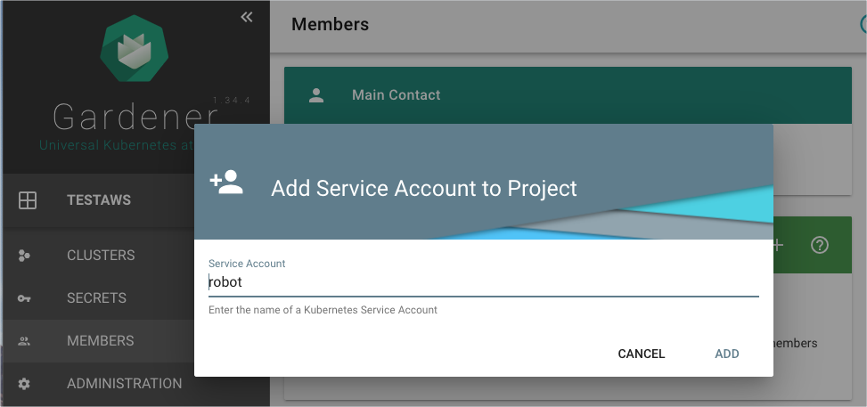
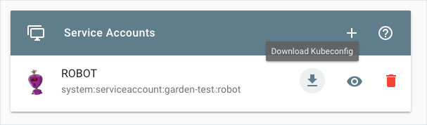

# Provision a GCP cluster with Gardener

## Overview

This example shows you how you can use Hydroform to provision a cluster on Google Cloud Platform (GCP) with Gardener. For the example to work, you need to configure Gardener and GCP to allow access. 


## Installation

### Configure Gardener and GCP

1. Use [these instructions](https://gardener.cloud/050-tutorials/content/howto/gardener_gcp/) to perform the following steps:

    1. Create a project in Gardener.
    2. Learn more about roles required by Gardener.
    3. Create a new service account and roles.
        >**NOTE:** Run `gcloud auth application-default login` and log in with your Google Cloud credentials to get authenticated by Google SDK.
    4. Add the secret in Gardener. 

2. In Gardener, go to **Members** > **Service Accounts** and add a new service account. 

    

3. Download and save the `kubeconfig` file for this service account. 

    

### Run the example

1. To provision a new cluster on GCP, go to the `hydroform` directory and run:

```
go run ./examples/gardener/main.go -p {project_name} -c {/path/to/gardener/kubeconfig} -s {GCP-secret-name}

```

2. In Gardener, go to **Clusters**. You should see your cluster listed there.