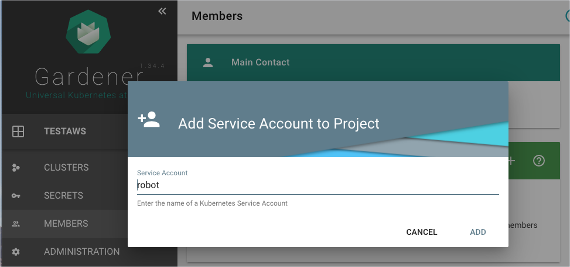
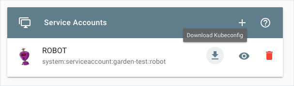

# Provision an AWS cluster with Gardener

## Overview

This example shows you how you can use Hydroform to provision a cluster on Amazon Web Services platform using Gardener. For the example to work, you need to configure Gardener and AWS to allow access. 


## Installation

### Configure Gardener and AWS


1. Use [these instructions](https://gardener.cloud/050-tutorials/content/howto/gardener_aws/) to perform the following steps:

    1. Create a project in Gardener.
    2. Check and copy the AWS policy. AWS needs it to grant access for Gardener.
    3. Create a new policy and Gardener technical user in AWS.
    4. Add a new secret in Gardener. 

2. In Gardener, go to **Members** > **Service Accounts** to add a new service account. 

    

3. Download and save the `kubeconfig` file for this service account. 

    

### Run the example

1. To provision a new cluster on AWS, go to the `provision` directory and run:

```
go run ./examples/gardener/main.go -p {project_name} -c {/path/to/gardener/kubeconfig} -s {AWS-secret-name} --persist
```
2. In Gardener, go to **Clusters** to see your cluster on the list.