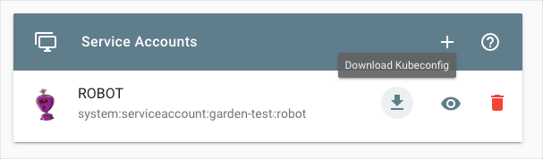

# Provision an Azure cluster with Gardener

## Overview

This example shows you how you can use Hydroform to provision a cluster on Microsoft Azure Cloud (Azure) with Gardener. For the example to work, you need to configure Gardener and Azure to allow access. 


## Installation

### Configure Gardener and Azure


1. Create a project in Gardener. 

    

2. Go to **Secrets** > **Microsoft Azure Cloud**. Click **?** to learn more about Azure Secrets. Azure needs the secrets configured to grant access for Gardener.

3. Request an Azure service account, you don't have it already.

4. Once you have the account, log in to Azure to get the properties of your Azure account:

* For **Tenant ID**, go to **Azure Active Directory** > **Properties** and copy the **Directory ID**.
* For **Subscription ID**, go **Subscriptions**  and copy the Subscription ID.
* For **Client ID**, go to **Subscriptions** > **Access control (IAM)** >**Role Assignments**. Find your Service Principal and click it. Go to **Properties** and copy the **Application ID**.
* For **Client Secret**, copy **Key Value** you received in the email with Service Principle credentials.

4. In Gardener, go to **Secrets** > **Azure** and add a new secret.

    

6. Go to **Members** > **Service Accounts** to add a new service account. 

    

7. Download and save the `kubeconfig` file for this service account. 

    

### Run the example

1. To provision a new cluster on Azure, go to the `provision` directory and run:

```
go run ./examples/gardener/main.go -p {project_name} -c {/path/to/gardener/kubeconfig} -s {Azure-secret-name} --persist

```

2. In Gardener, go to **Clusters** to see your cluster on the list.