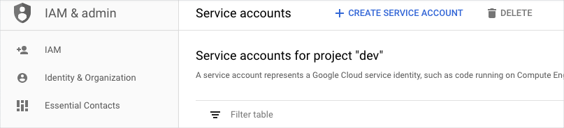
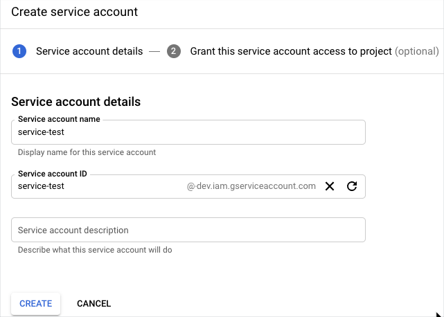
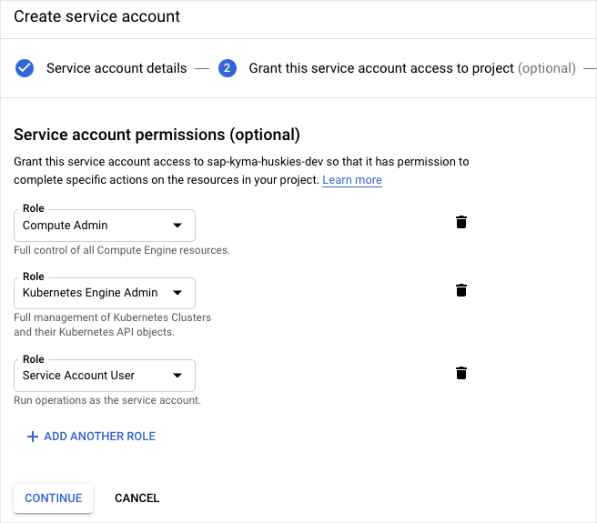
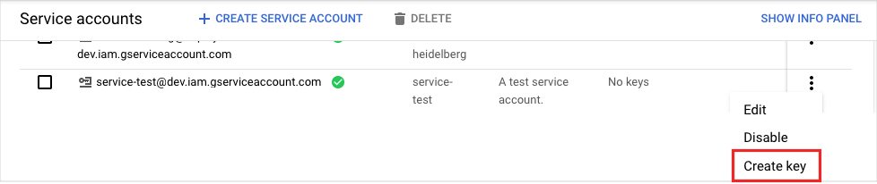

# Provision a Google Kubernetes Engine (GKE) cluster

## Overview

This example shows you how to use Hydroform to provision a GKE cluster on Google Cloud Platform.

## Installation

### Configure GCP

To provision a GKE cluster you need a service account the details of which you will pass as properties when executing this example.

1. Log in to GCP. Run:

```bash
gcloud auth application-default login
```

Log in using Google Cloud credentials.

2. Go to **IAM & Admin** > **Service accounts**.

3. Click **Create service account**.



4. Provide the details of your account.



5. Assign the roles.

>**NOTE**: The roles you need are Compute Admin, Kubernetes Engine Admin, and Service Account User.



6. Optionally, you can grant access to this service account to specific users.

7. Save your configuration.

8. In the main **Service Account**  view, create and store the service account key for your account.



### Run the example

1. To provision a new cluster on GCP, go to the `hydroform` directory and run:

```bash
go run ./examples/gcp/main.go -p {project_name} -c /{path/to/service_account_key.json}
```

2. Go to **Kubernetes Engine** > **Clusters** to see your cluster on the list.

3. Export **GOOGLE_APPLICATION_CREDENTIALS** environment variable pointing to the service account key.  

```bash
export GOOGLE_APPLICATION_CREDENTIALS={path/to/service_account_key.json}
```

4. Export **KUBECONFIG** environment variable pointing to the `kubeconfig` file generated by running the example. This will allow access to the cluster.

```bash
export KUBECONFIG=$(pwd)/kubeconfig.yaml
```
